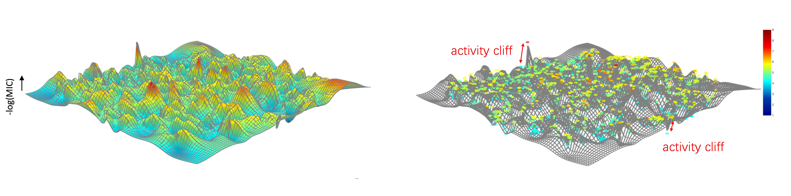

# AMPCliff


testing plenty of models for AMP activity cliff prediction


<!-- TOC -->
<!-- /TOC -->

- [AMPCliff](#ampcliff)
  - [Getting Started](#getting-started)
    - [Step1. Installation](#step1-installation)
    - [Step2. Dependencies](#step2-dependencies)
    - [Step3. Get Data](#step3-get-data)
  - [Running](#running)
    - [1. Machine Learning Method](#1-machine-learning-method)
    - [2. Deep Learning Method](#2-deep-learning-method)
    - [3. GLMs and MLMs](#3-glms-and-mlms)
  - [Other Settings](#other-settings)
    - [load checkpoints](#load-checkpoints)
    - [Debug Mode](#debug-mode)
    - [MLFlow Setting](#mlflow-setting)
  - [Citation](#citation)
  - [Contact](#contact)

## Getting Started
### Step1. Installation
```bash
git clone git@github.com:Kewei2023/AMPCliff.git

cd AMPCliff # the folder name must be AMPCliff 
```
### Step2. Dependencies
- If on the supercomputer
```bash
conda env create -f environment.yaml
source activate AMPCliff 
```
- If on the local machine
```bash
conda env create -f environment.yaml
conda activate AMPCliff 
```
### Step3. Get Data
Save the data in the `./data` folder
ℹ️ Please go to [AMPCliff-generation](https://github.com/Kewei2023/AMPCliff-generation) for AC generation.
## Running
🚀 change `data.regression.mode` as:

 - `random` for 5-fold corss validation, keep `stratified=True`.
 
 - `fix` as AC Split

### 1. Machine Learning Method
🚀 set `model.regression.check_point.load` in `downstream.yaml` to `false`.

- If on the supercomputer
```bash
sbatch --gpus=1 machine_learning_train.sh
```
- If on the local machine
```bash
python machine_learning_train.py
```
### 2. Deep Learning Method
🚀 set `model.regression.check_point.load` in `downstream.yaml` to `false`.

📢*for deep learning method, change `features.type` as follows*


<div align="center">

| Models      | type|
|---------------|---------------------------------------|
| CellFree-cnn     | CellFree-cnn|
| CellFree-rnn     | CellFree-rnn|
| AMPSpace     | AMPSpace |
| peptimizer     | peptimizer |
</div>

- modify `features.type` in `./config/downstram.yaml`
```yaml
features:
  type: CellFree-cnn # LLM  # CellFree-cnn # CellFree-rnn # AMPSpace # peptimizer
```

- modify `model.regression.version`, the **SAME** value as `features.type`
```yaml
model:
  ...
  regression:
    version: CellFree-cnn # gpt2-base # progen2-medium # progen2-base # esm2_t12 # progen2-small # gpt2-large # gpt2-base # esm2_t33 # gpt2-large # bert-base # protgpt2 # CellFree-cnn # CellFree-rnn # AMPSpace # v1 # AMPSpace, CellFree-cnn, SeqUNet
```
### 3. GLMs and MLMs

- Changing Models

🚀 for LLM, `features.type` always `LLM`

- modify `configs/downstream.yaml`
```yaml
model:
  config_dir: "/data/public/models/gpt2-large/" 
  regression:
    version: gpt2-large 
``` 
- Run

🚀 set `ddp` in `downstream.yaml` to `false`.

- If on the supercomputer
```bash
sbatch --gpus=1 downstream_train.sh
```
- if on the local machine
```bash
python downstream_train.py
```
📢Here we support the following models(the practicer can found these models in [HuggingFace](https://huggingface.co/)):

<div align="center">

| Models      | config_dir                           |
|---------------|---------------------------------------|
| bert-base     | `/data/public/models/bert-base-uncased/`|
| esm2_t6   | `/data/public/models/facebook/esm2_t6_8M_UR50D/`|
| esm2_t12     | `/data/public/models/facebook/esm2_t12_35M_UR50D/`|
| esm2_t33     | `/data/public/models/facebook/esm2_t33_650M_UR50D/`|
| protgpt2     | `/data/public/models/ProtGPT2/`|
| gpt2-base   | `/data/public/models/gpt2/`|
| progen2-small     | `/data/public/models/progen2/progen2_small/`|
| progen2-base     | `/data/public/models/progen2/progen2_base/`|
| progen2-medium     | `/data/public/models/progen2/progen2_medium/`|
</div>

## Other Settings
### load checkpoints

set `check_point.load`=`true` and give a model path to `check_point.path`

```bash
sbatch --gpus=1 downstream_evaluate.sh
```
### Debug Mode
set `other.debug` to `true`

```bash
other:
  debug: true # false # false # False
```

### MLFlow Setting

- **URL:** the URL depends on the IP adress of the machine, for Linux please use `ifconfig` command to check

- **Port:** don't change 
```bash
source activate AMPCliff
conda env config vars set MLFLOW_EXPERIMENT_NAME=breeze
conda env config vars set MLFLOW_S3_ENDPOINT_URL=http://192.168.1.23:5002 #
conda env config vars set MLFLOW_TRACKING_URI=http://192.168.1.23:5002
conda env config vars set REGISTERED_MODEL_NAME=breezeModel
```
## Citation
If you find our code or paper useful, please cite:
```bibtex
@article{AMPCliff,
  title={AMPCliff: quantitative definition and benchmarking of activity cliffs in antimicrobial peptides},
  author={Kewei Li, Yuqian Wu, Yinheng Li, Yutong Guo, Yan Wang, Yiyang Liang, Yusi Fan, Lan Huang, Ruochi Zhang, Fengfeng Zhou},
  journal={arXiv},
  year={2024}
}
```


## Contact
kwbb1997@gmail.com or FengfengZhou@gmail.com