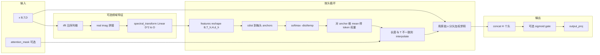

# MultiHeadSpectralAnchorPooling 实现说明

本文说明 [`MultiHeadSpectralAnchorPooling`](../factory/pooling/spectral_anchor_v2.py) 的实现原理、与单头 V2 的差异、注册表推导及 Hydra/脚本调用方式。更一般的谱锚讨论见 [spectral_anchor_analysis.md](spectral_anchor_analysis.md)。

## 1. 类定位与命名注意

- **类名**：`MultiHeadSpectralAnchorPooling`（实现见 [`spectral_anchor_v2.py` 约第158–310行](../factory/pooling/spectral_anchor_v2.py)）。
- **与配置名 `spectral_anchor_v2` 的区别**：Hydra 中 `model.regression.pooling=spectral_anchor_v2` 对应的是 **`SpectralAnchorPoolingV2`**（单头、多种 `aggregation`），**不是** `MultiHeadSpectralAnchorPooling`。本类在注册表中通过 **`multi_head_spectral`** 启用（见 [`registry.py`](../factory/pooling/registry.py)）。

## 2. 实现原理（数据流）



### 2.1 论文用算法框（`algorithm` + `algpseudocode`）

顶会/期刊正文里常见的「算法框架」多为**带行号的伪代码块**。下面给出与当前实现一致的 **LaTeX** 版本（需 `algorithm`、`algpseudocode`，或改用 `algorithm2e` 自行套壳）。**§2 的数据流 Mermaid 图**对应张量管线；本节可直接放进论文。

**符号**：批次大小 \(B\)，序列长 \(T\)，隐维度 \(D\)，头数 \(H\)，\(d_h=D/H\)，每头锚数 \(K\)；\(\mathbf{A}^{(h)}\in\mathbb{R}^{K\times d_h}\) 为第 \(h\) 头可学习锚；\(\tau_h\) 为温度；\(\mathbf{W}_{\mathrm{spec}}\)、\(\mathbf{W}_{\mathrm{out}}\)、\(\mathbf{W}_g\)（可选）为线性层；\(\odot\) 为逐元素积；\(\sigma\) 为 logistic。

```latex
\begin{algorithm}[t]
\caption{Multi-Head Spectral Anchor Pooling (forward)}
\label{alg:mhsap}
\begin{algorithmic}[1]
\Require Hidden states $\mathbf{X} \in \mathbb{R}^{B \times T \times D}$;
       optional mask $\mathbf{M} \in \{0,1\}^{B \times T}$ (broadcast as needed);
       flags $\texttt{use\_fft}$, $\texttt{gated}$; hyperparameters $H$, $K$, dropout $p$.
\Ensure Pooled representation $\mathbf{z} \in \mathbb{R}^{B \times D}$
\If{\texttt{use\_fft}}
    \State $\widetilde{\mathbf{X}} \gets \mathrm{rFFT}(\mathbf{X})$ along the sequence axis
    \State $\mathbf{F} \gets \mathrm{Linear}\big(\mathrm{concat}(\Re\,\widetilde{\mathbf{X}}, \Im\,\widetilde{\mathbf{X}})\big)$ \Comment{truncate/pad channels to $2D$ then project to $D$}
    \State Let $T'$ be the sequence length of $\mathbf{F}$
\Else
    \State $\mathbf{F} \gets \mathbf{X}$, \quad $T' \gets T$
\EndIf
\State Reshape $\mathbf{F}$ to $\mathbb{R}^{B \times T' \times H \times d_h}$
\State $\mathcal{O} \gets []$
\For{$h = 0$ \textbf{to} $H-1$}
    \State $\mathbf{F}_h \gets \mathbf{F}_{:,:,h,:} \in \mathbb{R}^{B \times T' \times d_h}$
    \State $\mathbf{D} \gets \mathrm{cdist}(\mathbf{F}_h, \mathbf{A}^{(h)}) \,/\, \sqrt{d_h}$ \Comment{$\mathbf{D}\!\in\!\mathbb{R}^{B\times T'\times K}$; default $\ell_2$}
    \State $\boldsymbol{\alpha} \gets \mathrm{softmax}(-\mathbf{D} / \tau_h)$ along anchor axis
    \State $\mathbf{w} \gets \frac{1}{K}\sum_{k=1}^{K} \boldsymbol{\alpha}_{:,:,k}$ \Comment{$\mathbf{w} \in \mathbb{R}^{B \times T'}$; matches \texttt{mean(dim=-1)}}
    \If{$T' \neq T$}
        \State Interpolate $\mathbf{w}$ along time to length $T$ (linear)
    \EndIf
    \State $\mathbf{w} \gets \mathbf{w} \odot \mathbf{M}$, then normalize each row over time to sum $1$
    \State Let $\mathbf{X}^{(h)} \in \mathbb{R}^{B \times T \times d_h}$ be head $h$ of original $\mathbf{X}$
    \State $\mathbf{o}_h \gets \sum_{t=1}^{T} w_{b,t}\, \mathbf{X}^{(h)}_{b,t,:}$ (for all $b$) \Comment{equiv.\ $(\mathbf{X}^{(h)} \odot \mathbf{w})$ then sum on $t$}
    \State Append $\mathbf{o}_h$ to $\mathcal{O}$
\EndFor
\State $\mathbf{z} \gets \mathrm{concat}(\mathcal{O})$ along feature dim \Comment{$\mathbb{R}^{B \times D}$}
\State $\mathbf{z} \gets \mathrm{Dropout}_p(\mathbf{z})$
\If{\texttt{gated}}
    \State $\mathbf{z} \gets \mathbf{z} \odot \sigma(\mathbf{W}_g \mathbf{z})$
\EndIf
\State \Return $\mathbf{W}_{\mathrm{out}} \mathbf{z}$
\end{algorithmic}
\end{algorithm}
```

**编译提示**：若使用 `algorithmicx` 的 `algpseudocode`，需 `\usepackage{algorithm}`、`\usepackage{algpseudocode}`；`\Re`/`\Im` 需 `amsmath`；行内注释可用 `\Comment{...}`。

**要点**：

1. **多 head 切分**：`d_model` 必须被 `num_heads` 整除，`head_dim = d_model // num_heads`。
2. **可选 FFT 分支**（`use_fft=True`）：对 `x` 做 `torch.fft.rfft(x, dim=1)`，将实部与虚部拼接，截断/零填充到 `d_model * 2` 维后经 `spectral_transform` 映回 `d_model`；**加权池化仍用原始 `x` 按 head 切片**（见代码注释 *Use original x for pooling*）。
3. **每头谱锚**：`torch.cdist` 默认 **L2（欧氏）距离** \(\|x-a\|_2\)；再除以 \(\sqrt{d_h}\)，经可学习温度 \(\tau_h\) 做 softmax；对 anchor 维 **取均值** 得到每个时间步标量权重。
4. **序列长度**：若 FFT 后 `feat_seq_len != seq_len`，对权重做线性 `interpolate` 对齐。
5. **mask**：`attention_mask` 乘在权重上再按时间归一化。
6. **输出**：各 head 向量拼接 → `dropout` → 可选 `sigmoid(gate)` 逐元相乘 → `output_proj`。

核心 `forward` 与 `_compute_head_attention`：

```218:232:factory/pooling/spectral_anchor_v2.py
    def _compute_head_attention(
        self, x_head: torch.Tensor, head_idx: int
    ) -> torch.Tensor:
        """Compute attention weights for a single head."""
        anchors = self.anchors[head_idx].unsqueeze(0).expand(x_head.size(0), -1, -1)

        # Compute distances
        dist = torch.cdist(x_head, anchors)
        dist = dist / (self.head_dim ** 0.5)

        # Softmax with per-head temperature
        temp = self.temperatures[head_idx].abs().clamp(min=0.1, max=10.0)
        attn = torch.softmax(-dist / temp, dim=-1)

        return attn
```

```234:310:factory/pooling/spectral_anchor_v2.py
    def forward(
        self, x: torch.Tensor, attention_mask: Optional[torch.Tensor] = None
    ) -> torch.Tensor:
        """Forward pass with multi-head processing."""
        batch_size, seq_len, _ = x.shape

        # Compute spectral features if needed
        if self.use_fft:
            fft_result = torch.fft.rfft(x, dim=1)
            spectral = torch.cat([fft_result.real, fft_result.imag], dim=-1)
            # Ensure we have exactly d_model * 2 features
            spectral = spectral[:, :, : self.d_model * 2]
            if spectral.size(-1) < self.d_model * 2:
                # Pad if necessary
                padding = torch.zeros(
                    batch_size,
                    spectral.size(1),
                    self.d_model * 2 - spectral.size(-1),
                    device=spectral.device,
                    dtype=spectral.dtype,
                )
                spectral = torch.cat([spectral, padding], dim=-1)
            features = self.spectral_transform(spectral)
        else:
            features = x

        # Reshape for multi-head processing
        features = features.view(batch_size, -1, self.num_heads, self.head_dim)
        feat_seq_len = features.size(1)

        # Process each head
        head_outputs = []
        for h in range(self.num_heads):
            x_h = features[:, :, h, :]  # (B, feat_seq_len, head_dim)

            # Compute attention weights
            attn = self._compute_head_attention(x_h, h)

            # Aggregate: use mean of attention-weighted combination
            weight = attn.mean(dim=-1)  # (B, feat_seq_len)

            # Handle FFT length change - interpolate back to original seq_len
            if weight.size(1) != seq_len:
                weight = F.interpolate(
                    weight.unsqueeze(1),
                    size=seq_len,
                    mode="linear",
                    align_corners=False,
                ).squeeze(1)

            # Apply attention mask
            if attention_mask is not None:
                mask = attention_mask.to(dtype=weight.dtype)
                weight = weight * mask

            # Normalize
            weight = weight / weight.sum(dim=1, keepdim=True).clamp(min=1e-6)

            # Use original x for pooling (not spectral features)
            # Reshape x for this head
            x_orig_h = x.view(batch_size, seq_len, self.num_heads, self.head_dim)[:, :, h, :]
            pooled_h = (x_orig_h * weight.unsqueeze(-1)).sum(dim=1)
            head_outputs.append(pooled_h)

        # Concatenate head outputs
        pooled = torch.cat(head_outputs, dim=-1)  # (B, d_model)

        # Apply dropout
        pooled = self.dropout(pooled)

        # Gating
        if self.gated:
            gate = torch.sigmoid(self.gate(pooled))
            pooled = pooled * gate

        # Output projection
        return self.output_proj(pooled)
```

## 3. 注册表与 `num_anchor_per_head` 的推导

通过 [`build_pooling_modules`](../factory/pooling/registry.py) 构造模块；**仅当** `pooling == "multi_head_spectral"` 时实例化本类：

```148:156:factory/pooling/registry.py
    elif pooling == "multi_head_spectral":
        sap_pool = MultiHeadSpectralAnchorPooling(
            d_model=d_model,
            num_heads=num_heads,
            num_anchor_per_head=num_anchor // num_heads if num_anchor >= num_heads else 2,
            use_fft=use_fft,
            gated=gated,
            dropout=dropout,
        )
```

**含义**：`model.regression.pooling_common.num_anchor`（或 Hydra 顶层 `model.regression.num_anchor` 覆盖；默认 8）用于推导 **`num_anchor_per_head = num_anchor // num_heads`**；若 `num_anchor < num_heads` 则退化为 **2**。这与类构造函数中 `num_anchor_per_head: int = 4` 的默认值无关——经注册表构建时由上述公式覆盖。

[`apply_pooling`](../factory/pooling/registry.py) 在 `pooling in (..., "multi_head_spectral", ...)` 时调用 `sap_pool(features, attention_mask)`：

```204:207:factory/pooling/registry.py
    if pooling in ("spectral_anchor", "spectral_anchor_v2", "multi_head_spectral", "frequency_aware"):
        if sap_pool is None:
            raise RuntimeError(f"sap_pool is not initialized for pooling='{pooling}'")
        return sap_pool(features, attention_mask)
```

## 4. 调用方式

### 4.1 Hydra 训练

在 [`configs/downstream.yaml`](../configs/downstream.yaml) 中，`pooling_common` 与 `pooling_config.multi_head_spectral` 承载上述超参（亦可用扁平 CLI 覆盖）。启用本池化：

- `model.regression.pooling=multi_head_spectral`
- 可选：`model.regression.pooling_common.num_heads=...`、`model.regression.pooling_config.multi_head_spectral.use_fft=...`、`model.regression.pooling_common.gated=...`、`model.regression.pooling_common.num_anchor=...`、`model.regression.pooling_common.dropout=...`（亦支持旧版扁平 `model.regression.num_heads=` 等 CLI 覆盖）

回归路径上，`ClassificationHead` / `ClassificationHead2` 等在初始化时调用 `build_pooling_modules` 并传入上述配置（见 [`factory/regression.py`](../factory/regression.py)）。

### 4.2 批量脚本参考

[`evaluation_scripts/run_spectral_anchor_v2_ablation.sh`](../evaluation_scripts/run_spectral_anchor_v2_ablation.sh)（约第223–229 行）示例：

- `model.regression.pooling=multi_head_spectral`
- `model.regression.pooling_common.num_heads=${num_heads}`
- `model.regression.pooling_config.multi_head_spectral.use_fft=${fft}`
- `model.regression.pooling_common.gated=${gated}`

### 4.3 单测 / 直接实例化

见 [`tests/test_spectral_anchor_v2.py`](../tests/test_spectral_anchor_v2.py) 中 `TestMultiHeadSpectralAnchorPooling`。

## 5. 与 `SpectralAnchorPoolingV2` 的对比

| 维度 | `SpectralAnchorPoolingV2` | `MultiHeadSpectralAnchorPooling` |
|------|---------------------------|----------------------------------|
| pooling 名 | `spectral_anchor_v2` | `multi_head_spectral` |
| 谱特征 | 默认幅度谱 `abs(rfft)`（可关 FFT） | FFT 开时：实部+虚部拼接后经 Linear |
| 锚 | 全局 `(num_anchor, D)` | 每头 `(num_anchor_per_head, head_dim)` |
| 聚合 | soft / max / mean | 对 anchor softmax 后对 anchor 维 **mean** 得标量权重 |
| 输出 | 单向量 + 可选 input/output proj | 多头拼接 + 可选 gate + output proj |
