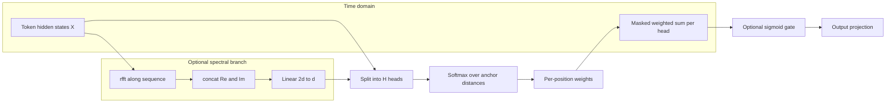

# Multi-Head Spectral Anchor Pooling for Protein Language Model Representations in Antimicrobial Peptide Activity-Cliff Regression

**Draft (English)** — *AMPCliff codebase* — *March 2026*

## Abstract

We introduce **multi-head spectral anchor pooling**, a sequence-to-vector module for fine-tuning protein language models (PLMs) on regression over antimicrobial peptide (AMP) **activity cliffs**. Pooling is difficult because cliff labels depend on subtle sequence edits; standard mean, max, or learned attention pooling may under-use structure in the token trajectory. Our module optionally maps hidden states along the sequence dimension with an **FFT-based linear transform** (real and imaginary parts of `rfft`), splits representations into **multiple heads**, and assigns each position a weight from **learnable anchor prototypes** with **per-head temperature**. Crucially, weights are inferred from (optional) spectral features, but **aggregation uses the original time-domain token representations**, decoupling “where to attend” from “what to pool.” An optional **sigmoid gate** and output projection follow head concatenation. Under a fixed **ESM-2-t12** backbone and a fixed **activity-cliff split** (`diff=5`, BLOSUM-based pairing) on *E. coli* and *S. aureus* datasets, we compare against mean, max, attention pooling, and single-stream `spectral_anchor`. Training uses **`model.regression.apply=none`** (no DC filtering or related variants in this study). On *E. coli* test Spearman correlation, the best multi-head configuration reaches **0.558** versus **0.555** for attention pooling and **0.504** for mean pooling. On *S. aureus*, the best multi-head configuration reaches **0.453** versus **0.406** for attention pooling; **test metrics are missing** for the exported mean/max baselines in our metrics sheet and must be re-run before claiming a full baseline table.

## 1. Introduction

Predicting whether a small sequence change induces a large potency jump—an **activity cliff**—is central to peptide lead optimization. PLMs such as ESM-2 provide contextual embeddings per residue, but downstream models require a **single vector** per sequence. Common poolings (mean, max, attention) treat the trajectory uniformly or learn content-based weights entirely in the time domain, which may not align with periodic or multi-scale structure along the sequence.

We propose **multi-head spectral anchor pooling** with three design goals: (i) an **optional harmonic decomposition** along sequence length as an inductive bias complementary to the PLM’s implicit modeling; (ii) **prototype-style** assignment to learnable anchors, encouraging lower-variance weighting than unstructured pairwise attention; (iii) **multi-head subspaces** with independent temperatures and anchor sets to reduce representation collapse.

**Contributions (draft bullets).**

1. A pooling layer that combines **FFT-feature-driven weights** with **time-domain aggregation** over the original hidden states (spectral–temporal decoupling).
2. A **multi-head** extension with **orthogonal anchor initialization**, **per-head softmax temperatures**, optional **gating**, and documented **Hydra wiring** for anchors per head (`num_anchor_per_head = num_anchor // num_heads` when `num_anchor >= num_heads`, else `2` in the current registry).
3. Empirical results on **AMP activity-cliff regression** (ESM-2-t12, two organisms) against mean / max / attention / `spectral_anchor`, plus ablations over **`num_heads`**, **`use_fft`**, and **`gated`**, exported from `outputs/ablation_metrics_exports/ablation_metrics_summary.csv`.

We **do not** report DC-component processing (`filter_dc`, `scale_dc`, `concat_dc`, `distill_vc`) here; the public ablation driver sets **`model.regression.apply=none`** (`evaluation_scripts/run_spectral_anchor_v2_ablation.sh`).

## 2. Method

### 2.1 Backbone and task

Given a sequence, a frozen or fine-tuned PLM yields hidden states `X ∈ ℝ^{B×T×d}` and an attention mask over valid positions. A linear regression head predicts a scalar cliff-related target (implementation: MSE loss, Spearman on validation/test). Only the pooling operator and head differ across compared runs.

### 2.2 Multi-head spectral anchor pooling

**Optional spectral path.** If `use_fft` is true, compute `Z = rfft(X, dim=1)` along the sequence axis. Concatenate `Re(Z)` and `Im(Z)` along the feature axis, truncate or pad to width `2d`, and apply a learned linear map `W_s : ℝ^{2d} → ℝ^{d}` so that spectral features `H` match the hidden size. If `use_fft` is false, set `H = X`.

**Multi-head split.** Reshape `H` into head subspaces: for `H` with length dimension `T′` (after FFT, `T′ = ⌊T/2⌋ + 1` for real input), view `H ∈ ℝ^{B×T′×H×(d/H)}` where `H` is `num_heads` (denoted `H` here; not to confuse with tensor `H`). Each head `h` uses slice `X_h ∈ ℝ^{B×T′×d_h}` with `d_h = d/H`.

**Anchor assignment.** For each head, learn anchors `A_h ∈ ℝ^{K×d_h}` (orthogonal init). Distances `‖x_{t,h} − a_{k,h}‖_2` yield logits scaled by `√d_h` and a **learnable temperature** `τ_h` (clamped for stability). Softmax gives `α_{t,k}`; we summarize over anchors with a **mean** over `k` to obtain a scalar weight per (batch, time) in that head’s length axis, matching the reference implementation.

**Align length to `T`.** If `T′ ≠ T`, linearly interpolate weights along time to length `T`, apply the padding mask, and renormalize per sequence.

**Aggregate in time domain.** For each head, take the corresponding slice of the **original** `X` (not spectral `H`), weight positions, and sum: `p_h = ∑_t w_{t,h} · x_{t,h}`. Concatenate `[p_1;…;p_H] ∈ ℝ^{d}`.

**Gate and project.** If `gated`, apply `σ(W_g p) ⊙ p`; then `W_o p` (with dropout optional). Output is the pooled vector fed to the regression head.

### 2.3 Configuration (reproducibility)

- **Registry** (`factory/pooling/registry.py`): for `pooling=multi_head_spectral`,  
  `num_anchor_per_head = num_anchor // num_heads` if `num_anchor >= num_heads`, else `2`.
- **Ablation script** (`evaluation_scripts/run_spectral_anchor_v2_ablation.sh`): sweeps `num_heads ∈ {2,4,8}`, `use_fft ∈ {true,false}`, `gated ∈ {true,false}`; leaves other Hydra defaults (e.g. `num_anchor=8` in `configs/downstream.yaml`) unless overridden.

### 2.4 Algorithm (pseudocode)

```
Input: X (B,T,d), mask M (B,T)
Hyper: num_heads H, use_fft, gated, anchors per head K

if use_fft:
    Z = rfft(X, dim=1)
    S = concat(Re(Z), Im(Z), dim=features)  # truncated/padded to 2d
    F = Linear_{2d→d}(S)
else:
    F = X
reshape F into (B, T', H, d/H)
for h in 1..H:
    Wh = anchor_softmax_weights(F[:,:,h,:])  # via cdist, τ_h, mean over anchors
    Wh = interpolate(Wh, length T) if needed
    Wh = normalize(Wh * M)
    ph = sum_t Wh[:,t] * X[:,t,h,:]
p = concat_h ph
if gated: p = sigmoid(Linear(p)) * p
return Linear_out(p)
```

### 2.5 Figure sketch (Mermaid)



## 3. Experiments

### 3.1 Setup

- **Model:** ESM-2-t12 (`esm2_t12`), regression head with compared pooling.
- **Data:** Activity-cliff splits for *E. coli* (`e_coli`) and *S. aureus* (`s_aureus`), `diff=5`, fixed train/valid/test CSVs (BLOSUM-based pairing as in the AMPCliff pipeline).
- **Training:** Script-aligned settings include `model.regression.apply=none`, `data.regression.mode=fix`, learning rate `1e-5`, batch size `4`, cosine schedule as in project configs (see Hydra logs for each run for exact overrides).
- **Metric:** Test **Spearman** correlation (primary in configs); we report the exported `test_spearman` from `ablation_metrics_summary.csv`.

### 3.2 Main comparison (ESM-2-t12, `spectral_anchor_v2_ablation` rows)

| Pooling | *E. coli* test Spearman | *S. aureus* test Spearman |
|--------|-------------------------|---------------------------|
| mean | 0.5038 | **missing** in export (run incomplete) |
| max | 0.5525 | **missing** in export (run incomplete) |
| attn | 0.5547 | 0.4060 |
| **multi_head_spectral (best)** | **0.5584** (`H=8`, FFT on, gated on) | **0.4531** (`H=2`, FFT on, gated off) |

**Caveat.** For *S. aureus*, mean and max rows in the CSV have empty `test_pearson` / `test_spearman`; **do not** cite them as baselines until metrics are populated.

### 3.3 Ablations: `num_heads` × `use_fft` × `gated` (test Spearman)

**Table 2a — *E. coli* (`esm2_t12`, multi_head_spectral).**

| H | FFT | Gated | Test Spearman |
|---|-----|-------|----------------|
| 2 | off | off | 0.5405 |
| 2 | off | on | 0.5262 |
| 2 | on | off | 0.5182 |
| 2 | on | on | 0.5052 |
| 4 | off | off | 0.5367 |
| 4 | off | on | 0.5445 |
| 4 | on | off | 0.5493 |
| 4 | on | on | 0.5499 |
| 8 | off | off | 0.5358 |
| 8 | off | on | 0.5425 |
| 8 | on | off | 0.5579 |
| 8 | on | on | **0.5584** |

**Table 2b — *S. aureus* (`esm2_t12`, multi_head_spectral).**

| H | FFT | Gated | Test Spearman |
|---|-----|-------|----------------|
| 2 | off | off | 0.4130 |
| 2 | off | on | 0.4256 |
| 2 | on | off | **0.4531** |
| 2 | on | on | 0.4559 |
| 4 | off | off | 0.4285 |
| 4 | off | on | 0.4443 |
| 4 | on | off | 0.4372 |
| 4 | on | on | 0.4293 |
| 8 | off | off | 0.4197 |
| 8 | off | on | 0.4206 |
| 8 | on | off | 0.3971 |
| 8 | on | on | 0.4247 |

### 3.4 Single-stream `spectral_anchor` reference (same export, *E. coli* best per k)

For context (not the main claim): among `spectral_anchor` with `k ∈ {2,4,8}` and FFT on/off, the strongest *E. coli* test Spearman in this sheet is **0.5408** (`k=2`, FFT off), slightly below the best multi-head result.

## 4. Related Work (placeholders — verify before submission)

- PLMs for proteins: **ESM-2** and follow-ups — `[PLACEHOLDER_esm2]`.
- Fourier / frequency layers in Transformers (e.g. FNet, AFNO, FEDformer) — `[PLACEHOLDER_fnet]`, `[PLACEHOLDER_afno]`, `[PLACEHOLDER_fedformer]`.
- Set pooling, inducing points, prototype-style attention (Set Transformer, Deep Sets) — `[PLACEHOLDER_set_transformer]`, `[PLACEHOLDER_deep_sets]`.
- Multi-head attention (Vaswani et al.) — `[PLACEHOLDER_transformer2017]`.
- Gating (GLU, Squeeze-and-Excitation) — `[PLACEHOLDER_glu]`, `[PLACEHOLDER_senet]`.
- Non-local / attention as weighting — `[PLACEHOLDER_nonlocal]`.

**Instruction:** Replace each placeholder with BibTeX entries fetched via DOI or Semantic Scholar; do not invent bibliographic metadata.

## 5. Limitations and Future Work

- **Incomplete baselines:** *S. aureus* mean/max test metrics missing in the exported CSV; rerun and update tables.
- **Single seed / no significance tests** in this draft; add multiple runs if targeting a venue that expects them.
- **No DC pipeline** in this manuscript; orthogonal constraints, knockout, and spectral-filter analyses are out of scope here.
- **Interpretability:** linking learned weights to frequency bands and structural motifs is **future work** (not evaluated in this draft).
- **Theory:** a unified “spectral bias + prototype learning” view is speculative discussion only.

## 6. Papers to Verify (checklist)

| Topic | Candidate handle | Action |
|-------|------------------|--------|
| ESM-2 | PLACEHOLDER_esm2 | Confirm exact title, authors, venue |
| FNet | PLACEHOLDER_fnet | Verify ICML 2021 metadata |
| AFNO | PLACEHOLDER_afno | Verify ICLR 2022 metadata |
| FEDformer | PLACEHOLDER_fedformer | Verify ICML 2022 metadata |
| Set Transformer | PLACEHOLDER_set_transformer | ICML 2019 |
| Deep Sets | PLACEHOLDER_deep_sets | NeurIPS 2017 |
| Transformer | PLACEHOLDER_transformer2017 | NeurIPS 2017 |
| GLU | PLACEHOLDER_glu | Verify Dauphin et al. details |
| SENet | PLACEHOLDER_senet | CVPR 2018 |
| Non-local | PLACEHOLDER_nonlocal | CVPR 2018 |
| AMP / cliff / peptide property | PLACEHOLDER_amp_app | Add 2–4 application papers |

---

*Source metrics file:* `outputs/ablation_metrics_exports/ablation_metrics_summary.csv` (rows `experiment_type == spectral_anchor_v2_ablation`, model `esm2_t12`, `diff == 5`).

*Code:* `factory/pooling/spectral_anchor_v2.py` (`MultiHeadSpectralAnchorPooling`), `factory/pooling/registry.py`.
